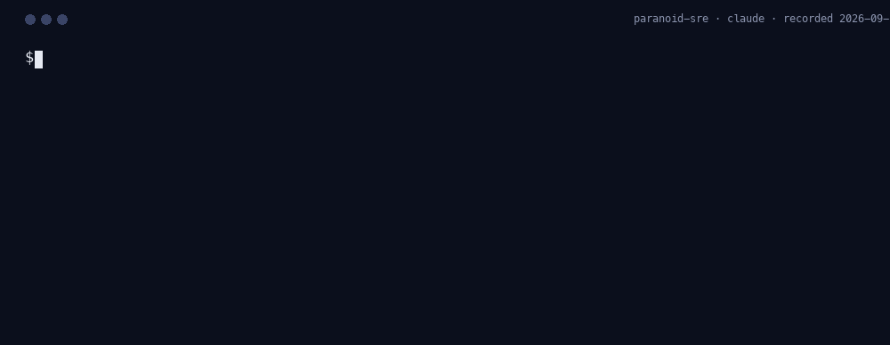
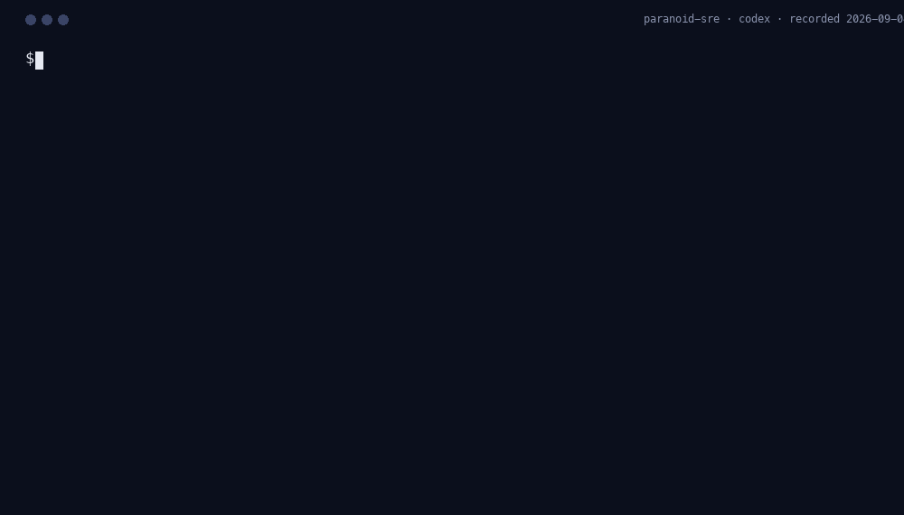
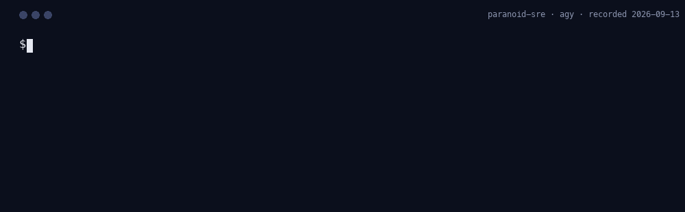
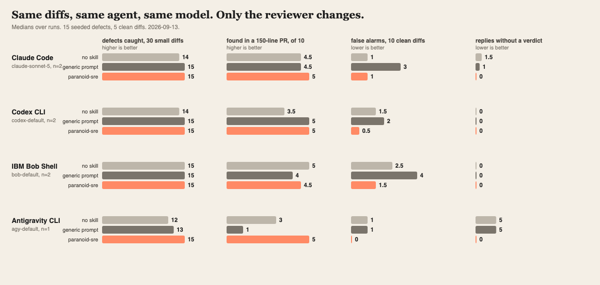

<p align="center">
  
</p>

<h1 align="center">paranoid-sre</h1>

<p align="center"><em>It works. Now tell me how it fails.</em></p>

<p align="center"><strong>Site:</strong> <a href="https://lazy-senior-dev.github.io/paranoid-sre/">lazy-senior-dev.github.io/paranoid-sre</a> · <strong>The cast:</strong> <a href="https://lazy-senior-dev.github.io/">lazy-senior-dev.github.io</a></p>

<p align="center">
  <a href="https://github.com/lazy-senior-dev/paranoid-sre"></a>
  <a href="CHANGELOG.md"></a>
  
  <a href="#github-action"></a>
  <a href="LICENSE"></a>
</p>

**Your agent's deploy, reviewed by the on-call engineer who has been paged for every mistake on the laminated card taped to her monitor, before it reaches production.**

<!-- bench:author:start -->
## The number that matters: what ships

**When the agent is the author, the Paranoid SRE changes what ships.** On IBM Bob Shell (`bob-default`), given 9 tickets that each invite a classic defect, the agent alone shipped the defect in 12 of 18 runs (67%), 4 of 18 with a generic "be careful" prompt (22%), and 0 of 18 with the Paranoid SRE installed, where he refuses the write until the findings are fixed (0%). A task the agent declined or solved another way counts as clean. The shipped code is scored by fixed checks written before any run, never by a model. Each task was run 2 times per arm; [method, per-task table, raw diffs](benchmarks/results/author).

| Agent | Model | Arm | Made the change | Shipped the defect | Self-reviewed | Median time | Median cost |
|---|---|---|---|---|---|---|---|
| IBM Bob Shell | `bob-default` (n=2) | no skill | 18 of 18 | 12 of 18 (67%) | n/a | 15 s | $0.11 |
| IBM Bob Shell | `bob-default` (n=2) | generic care prompt | 18 of 18 | 4 of 18 (22%) | n/a | 21 s | $0.13 |
| IBM Bob Shell | `bob-default` (n=2) | paranoid-sre | 18 of 18 | 0 of 18 (0%) | 18 of 18 | 35 s | $0.15 |
| IBM Bob Shell | `bob-default` (n=2) | **paranoid-sre + gate** | **18 of 18** | **0 of 18 (0%)** | **18 of 18** | 55 s | $0.33 |
| Claude Code | `claude-sonnet-5` (n=2) | no skill | 18 of 18 | 11 of 18 (61%) | n/a | 32 s | $0.24 |
| Claude Code | `claude-sonnet-5` (n=2) | generic care prompt | 18 of 18 | 0 of 18 (0%) | n/a | 53 s | $0.29 |
| Claude Code | `claude-sonnet-5` (n=2) | paranoid-sre | 18 of 18 | 0 of 18 (0%) | 18 of 18 | 83 s | $0.33 |
<!-- bench:author:end -->

<!-- bench:hero:start -->
**On IBM Bob Shell (`bob-default`), the Paranoid SRE catches 15 of 15 seeded defects, the same as the agent alone. What changes is discipline: false alarms on 5 clean diffs, 2 with her, 3 without; replies with no usable verdict per run, 0 either way; 94% of PAGE verdicts land on PAGE-class defects; median review time 11 s with her, 15 s without.** Median of 2 runs, measured 2026-09-04; [method, per-diff table, raw replies](benchmarks/results). **In the needle tier, where the same defect hides in a four-file, 150-line pull request, IBM Bob Shell finds 5 of 5 with the Paranoid SRE, 5 without, 4 with the generic prompt.**
<!-- bench:hero:end -->

<!-- recordings:start -->
## Watch her work on every agent

The same staged diff, one CLI, 4 agents. Each recording is a real run captured with `node scripts/capture-run.mjs --agent <name>` and rendered frame by frame from the transcript, nothing typed by hand and nothing cut. The captions come from the recording itself. Captured 2026-09-04.

| Claude Code | Codex CLI |
|---|---|
|  |  |
| <b>Verdict</b> SRE: PAGE<br><b>Findings</b> 4<br><b>Time</b> 40 s<br><b>Tokens</b> 7,771 in / 3,256 out<br><b>Cost</b> $0.0524 | <b>Verdict</b> SRE: PAGE<br><b>Findings</b> 4<br><b>Time</b> 30 s<br><b>Tokens</b> 18,469 in / 2,269 out<br><b>Cost</b> not reported by the host |

| Antigravity CLI | IBM Bob Shell |
|---|---|
|  |  |
| <b>Verdict</b> SRE: PAGE<br><b>Findings</b> 2<br><b>Time</b> 86 s<br><b>Tokens</b> 21,006 in / 32,192 out<br><b>Cost</b> not reported by the host | <b>Verdict</b> SRE: PAGE<br><b>Findings</b> 2<br><b>Time</b> 17 s<br><b>Tokens</b> not reported by the host<br><b>Cost</b> $0.0109 |

Every card lists the same five things; a host that does not report tokens or cost says so rather than leaving a blank. Agents that narrate the whole checklist before the verdict are shown from the verdict block down; the CLI prints it the same way. Re-capture any of them with `--agent claude|codex|agy|bob`; Bob needs `BOB_API_KEY`.
<!-- recordings:end -->

## The thirty-second version

Your agent edits a manifest, a Helm chart, a Terraform file, a Dockerfile, a pipeline. It looks fine. It has resource requests and a readiness probe. It also has no memory limit, a liveness probe that pings the database, and a rollout strategy that takes every replica down at once. Nothing between the agent and your cluster asks what happens at 3 a.m.

paranoid-sre puts the on-call engineer in the loop. Installed once, she reviews every write to deploy, infra, and CI files before it happens: ten questions about what happens after deploy, answered in writing, then a verdict. `SHIP` goes through. `HOLD` lists what pages and the smallest fix. `PAGE` (unbounded resources, no rollback, secrets in the wrong place, a rollout with no stop signal, privileged access) stops the write, whatever mode you are in. Same mechanics as [grumpy-reviewer](https://github.com/lazy-senior-dev/grumpy-reviewer), scoped to the files that page people. Works in Claude Code, Codex, Copilot CLI, IBM Bob, Antigravity, OpenCode, Cursor, and seven more. Also a GitHub Action.

## Who she is

Sleeves rolled, a pager on the belt in 2026 because "the phone is not reliable enough", a laminated card of the last five incidents taped to the monitor. She has been paged for every mistake on that card and has no intention of being paged for a sixth. She assumes the deploy will fail in the most expensive way available and makes the author show her why it cannot. Every objection names the resource, the failure mode in production, and the smallest change that removes it. She approves with two words: `Ship it.`

Paranoid, not obstructive: every finding comes with the smallest fix and a sentence on blast radius. "It passed staging" is not evidence. Staging has one replica and no customers.

## Before / after

**Friday, 16:40.** The ticket says "speed up api rollouts, they take 12 minutes". The agent writes:

```yaml
strategy:
  type: RollingUpdate
  rollingUpdate:
    maxUnavailable: 100%
    maxSurge: 0
```

Rollouts now take forty seconds. So does the outage each one causes. The Paranoid SRE reads it first:

```
SRE: HOLD
1. charts/api/values.yaml:10 — maxUnavailable 100% with maxSurge 0 takes all six replicas down on every deploy, so every rollout is a full outage — maxUnavailable: 25%, maxSurge: 25%, and let readiness gate the rest
```

The write is denied. The agent fixes it in two lines and reviews again:

```
SRE: SHIP — charts/api/values.yaml
Ship it.
```

Rollouts now take three minutes. Nobody notices them. That is the point.

## Numbers: reviewing a change someone else wrote

The tier above measures what The Paranoid SRE changes about code the agent writes. This one measures the review itself, on diffs the agent did not author.

<!-- bench:table:start -->
| Agent | Model | Arm | Defects caught (of 15) | False alarms (of 5) | Replies without a verdict (per run) | BLOCK precision | Median input tokens | Median output tokens | Median latency |
|---|---|---|---|---|---|---|---|---|---|
| IBM Bob Shell | `bob-default` (n=2) | no skill | 15 | 3 | 0 | n/a | 0 | 0 | 15 s |
| IBM Bob Shell | `bob-default` (n=2) | generic review prompt | 15 | 4 | 0 | n/a | 0 | 0 | 19 s |
| IBM Bob Shell | `bob-default` (n=2) | **paranoid-sre** | **15** | **2** | **0** | **94%** | 0 | 0 | 11 s |
| Antigravity CLI | `agy-default` (n=1) | no skill | 12 | 1 | 5 | n/a | 19500 | 2534 | 44 s |
| Antigravity CLI | `agy-default` (n=1) | generic review prompt | 13 | 1 | 5 | n/a | 19613 | 6602 | 52 s |
| Antigravity CLI | `agy-default` (n=1) | **paranoid-sre** | **15** | **0** | **0** | **100%** | 21154 | 29716 | 81 s |


**Needle tier** (one defect in a four-file pull request of about 150 lines):

| Agent | Model | No skill | Generic prompt | **Paranoid SRE** |
|---|---|---|---|---|
| IBM Bob Shell | `bob-default` (n=2) | 5/5 | 4/5 | **5/5** |
| Antigravity CLI | `agy-default` (n=1) | 3/5 | 1/5 | **5/5** |

<!-- bench:table:end -->

Fifteen deploy diffs, each with one seeded failure (a `latest` tag, no limits, a liveness probe on a dependency, an all-at-once rollout, a public bucket, a database with no deletion protection, a root container with a baked-in token, a deploy with no concurrency guard, a job with no deadline, an autoscaler deleted to save money), plus five clean ones. Every diff goes to the same agent three ways: no skill, a generic "review this carefully" prompt, and the Paranoid SRE. Method, per-diff table, raw replies and limitations: [benchmarks/results](benchmarks/results). Reproduce: `npm run bench && npm run bench:report`.

<p align="center"></p>

## How it works

One file, [`rules/paranoid-sre.md`](rules/paranoid-sre.md), is the whole ruleset. Every adapter in this repo is generated from it.

1. **Blast radius.** How many users, tenants, regions if it goes wrong? Can it touch fewer first?
2. **Health.** Readiness and liveness defined, distinct, and honest?
3. **Limits.** CPU, memory, connections, queue depth bounded? What happens at the bound?
4. **Rollout.** All at once, rolling, canary, flag? What signal stops it, and who watches?
5. **Rollback.** Undone by redeploying the previous version alone?
6. **Dependencies.** Timeout, retry budget, breaker, and what the user sees when it is down.
7. **Config and secrets.** Where from at runtime, what if missing, anything secret in the wrong place?
8. **Alerts.** Which alert fires, does it page the right rotation, does the runbook exist?
9. **Capacity.** Sized for what load, current peak, busiest day of the year?
10. **Cleanup.** Old resources, flags, dashboards removed, and who owns that?

**The verdict**: `SRE: SHIP | HOLD | PAGE`, then numbered `file:line — what fails in production — smallest fix` lines. `SHIP` names the files it covers and is followed by `Ship it.`

**The gate** fires only for files in her scope (manifests, charts, Terraform, Dockerfiles, CI, config). Code files are the Grump's job; she does not read them. **Modes**: `nag` (default), `gate`, `off`, shared with every persona through `GRUMPY_MODE`, a repository's `.grumpy.json`, or `~/.config/grumpy-reviewer/config.json`.

## Try her in 60 seconds, install nothing

```
npx github:lazy-senior-dev/paranoid-sre review            # working tree
npx github:lazy-senior-dev/paranoid-sre pr 123            # a pull request, via gh
```

Finds `claude`, `codex`, `agy`, or `bob` on your PATH, or any other agent through `LSD_AGENT_CMD`, sends the diff with her ruleset, prints the verdict, and exits 1 on anything but `SHIP`.

## Install

### Claude Code

```
/plugin marketplace add lazy-senior-dev/grumpy-reviewer
/plugin install paranoid-sre@lazy-senior-dev
```

One marketplace lists the whole cast; install any persona from it.

### Everything else

```
npx github:lazy-senior-dev/paranoid-sre install <host>     # bob, cursor, windsurf, cline, kiro, qoder, opencode, gemini, copilot, agents, all
```

Antigravity: `git clone https://github.com/lazy-senior-dev/paranoid-sre ~/.paranoid-sre && agy plugin install ~/.paranoid-sre`. Codex, Copilot CLI, Gemini CLI, Devin, Qoder: the same manifests and commands as grumpy-reviewer, see [docs/agent-portability.md](docs/agent-portability.md). Uninstall is one command everywhere: `npx github:lazy-senior-dev/paranoid-sre uninstall <host>`.

## GitHub Action

```yaml
- uses: lazy-senior-dev/paranoid-sre@v1
  with:
    mode: nag          # gate: request changes and fail the check until SHIP
    ignore: |
      docs/**
  env:
    ANTHROPIC_API_KEY: ${{ secrets.ANTHROPIC_API_KEY }}
```

One review per pull request, inline findings, updated in place. Point it at the same repository as the Grump's Action: one reviews the code, the other the deploy, and each posts its own review.

## Any MCP client

Every editor and desktop app that speaks the Model Context Protocol can use the Paranoid SRE without an adapter in this repository. The server is stdio, has no dependencies, and exposes four tools: `sre_review_diff`, `sre_review_staged`, `sre_review_pr`, and `sre_parse_verdict`, which turns a verdict block into JSON so a script can gate a commit or a merge on the level rather than on prose.

Claude Desktop (`claude_desktop_config.json`), Cursor (`~/.cursor/mcp.json`), Windsurf, and Zed:

```json
{
  "mcpServers": {
    "paranoid-sre": {"command":"npx","args":["-y","github:lazy-senior-dev/paranoid-sre","mcp"]}
  }
}
```

VS Code (`.vscode/mcp.json`):

```json
{
  "servers": {
    "paranoid-sre": { "type": "stdio", "command":"npx","args":["-y","github:lazy-senior-dev/paranoid-sre","mcp"]}
  }
}
```

Claude Code, in one line:

```sh
claude mcp add paranoid-sre -- npx -y github:lazy-senior-dev/paranoid-sre mcp
```

The server reviews with whichever headless agent it finds (`claude`, `codex`, `agy`, `bob` with `BOB_API_KEY`, or `ANTHROPIC_API_KEY`), so the client asking for the review and the agent performing it can be different tools. Nothing leaves your machine except the diff, going to the agent you already trust.

## Commands

| Command | What it does |
|---|---|
| `/sre [nag\|gate\|off]` | Set the mode. With no argument, report it. |
| `/sre-review` | Review the working-tree changes to deploy, infra, and CI files. Returns a numbered hold list. No edits. |
| `/sre-pr <number\|url>` | Review a pull request the same way. |
| `/sre-fix` | The only command that touches files: apply the findings from the last review, each as a separate minimal edit, then review again. |
| `/sre-scorecard` | What the Paranoid SRE caught this session, as a table. |
| `/sre-help` | This table. |

## Same desk

Three engineers, three jobs, one install path, one mode switch.

| Persona | Reads | Verdict | Measured on |
|---|---|---|---|
| [grumpy-reviewer](https://github.com/lazy-senior-dev/grumpy-reviewer) · [site](https://lazy-senior-dev.github.io/grumpy-reviewer/) | the diff, before it reaches your branch | `GRUMP: APPROVE \| REQUEST_CHANGES \| BLOCK` | defects caught |
| **paranoid-sre** · [site](https://lazy-senior-dev.github.io/paranoid-sre/) | the deploy: manifests, charts, Terraform, CI | `SRE: SHIP \| HOLD \| PAGE` | incidents prevented per rollout |
| [tenured](https://github.com/lazy-senior-dev/tenured) · [site](https://lazy-senior-dev.github.io/tenured/) | the change against the repository's history | `TENURED: NEW \| SEEN_BEFORE \| DO_NOT_REPEAT` | repeated outages avoided |

Install all three and each reviews its own territory: the Grump reads code, the Paranoid SRE reads what runs it, Tenured reads what history says about both. Every persona is generated from one markdown ruleset with the same machinery, so a fix in one lands in all. The cast: [lazy-senior-dev.github.io](https://lazy-senior-dev.github.io/).

## Security posture

No runtime dependencies, no network calls from the hooks, every third-party action pinned to a SHA, CodeQL and OpenSSF Scorecard on every push, provenance on npm publishes, and a written [threat model](SECURITY.md#threat-model). The hooks read the tool call and the transcript the host hands them; the only outbound traffic is the diff going to the agent you already run.

## FAQ

**Why a second persona instead of more rules for the Grump?** Because the questions are different. The Grump asks what the code does wrong; she asks what the cluster does when the code is right and the manifest is wrong. Keeping them apart keeps each ruleset short enough to read every turn, and lets a team run one without the other.

**Does she fight with the Grump?** No. Her gate fires only on deploy, infra, and CI paths; his fires on everything. A Terraform file gets her review; a Go file gets his; a Helm chart gets hers and, because he reads everything, his too, which is the point of having two reviewers.

**Who wrote this?** [Sandeep Bazar](https://www.linkedin.com/in/sandeepbazar/) ([@sandeepbazar](https://github.com/sandeepbazar)): fourteen years of platform infrastructure at IBM, Kubernetes and storage, and enough 3 a.m. pages to laminate a card.

## Contributing

The most valuable contribution is an incident: a change that shipped, paged someone, and would have been caught by one of the ten questions. Open an [issue](https://github.com/lazy-senior-dev/paranoid-sre/issues) with the change, what paged, and which question should have caught it; it becomes a benchmark case. Details in [CONTRIBUTING.md](CONTRIBUTING.md).

## License

[Apache-2.0](LICENSE). Copyright 2026 [Sandeep Bazar](https://www.linkedin.com/in/sandeepbazar/). Keep the [NOTICE](NOTICE) file with any redistribution.

Built and maintained by [Sandeep Bazar](https://www.linkedin.com/in/sandeepbazar/), part of [lazy-senior-dev](https://github.com/lazy-senior-dev).
